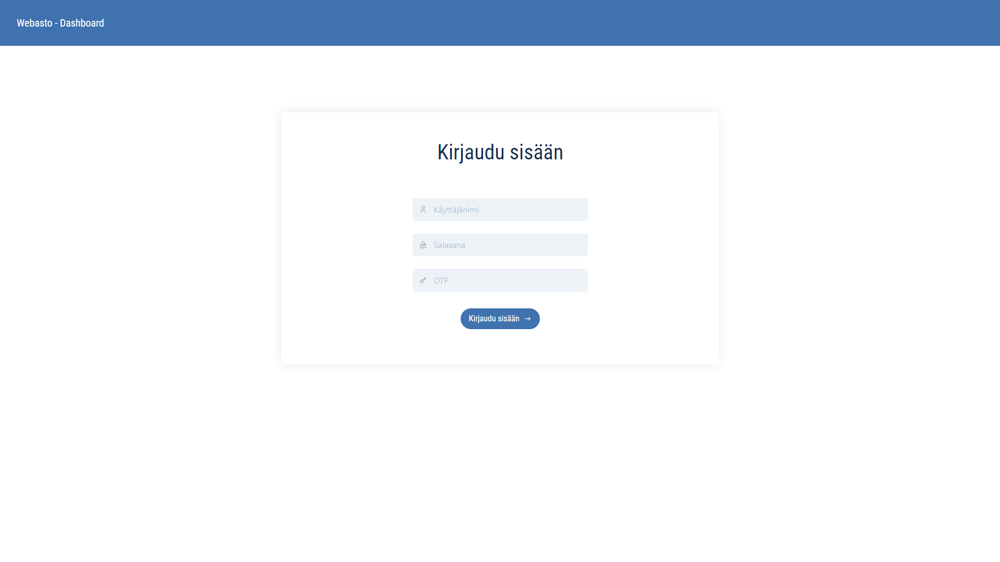
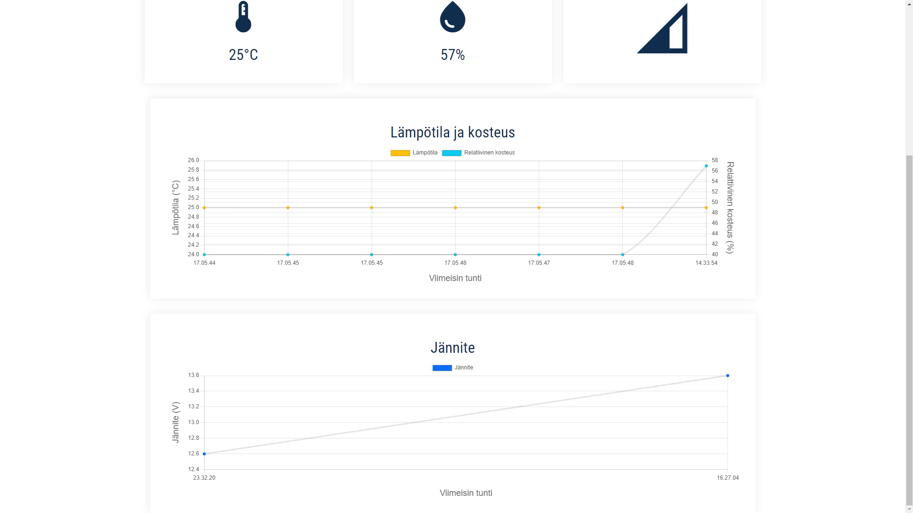
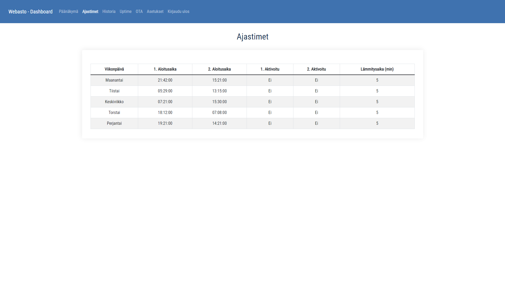
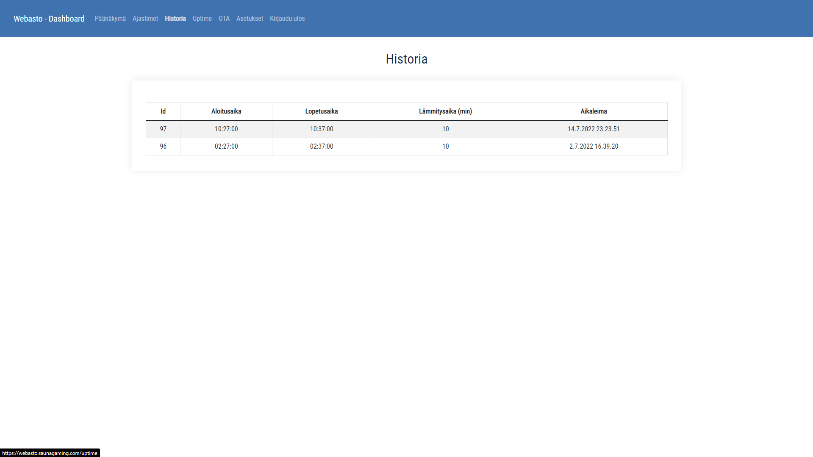
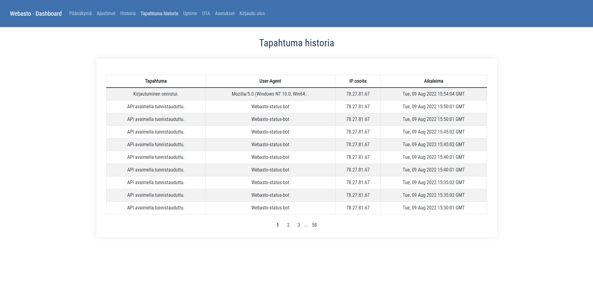
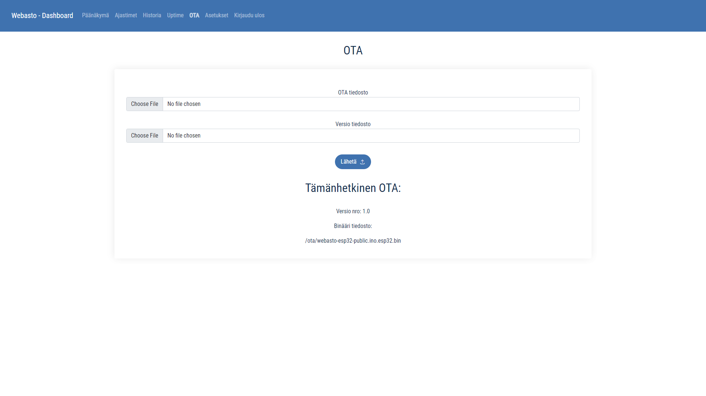
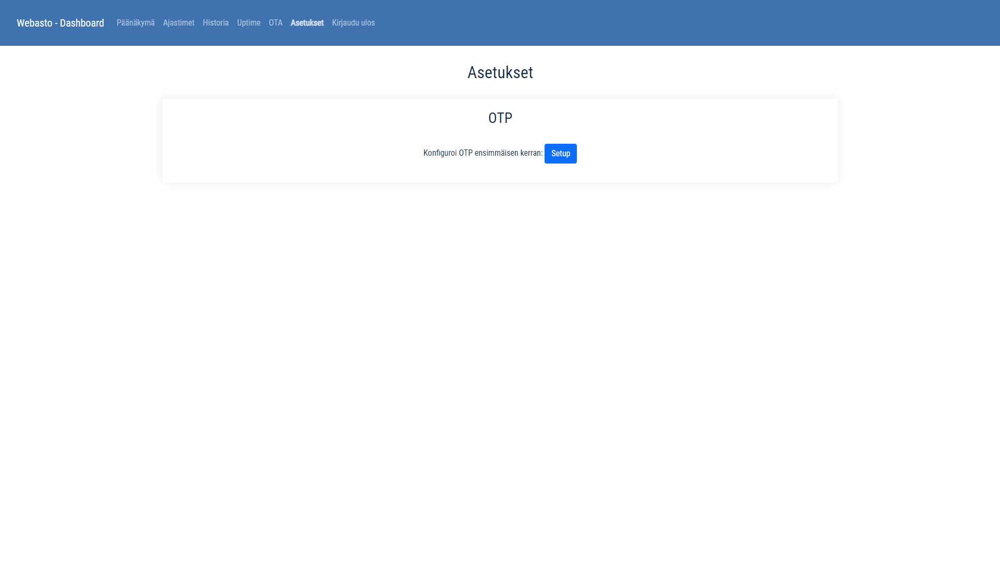
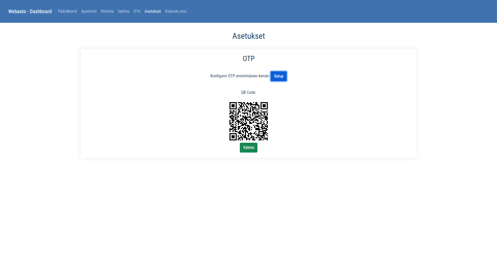
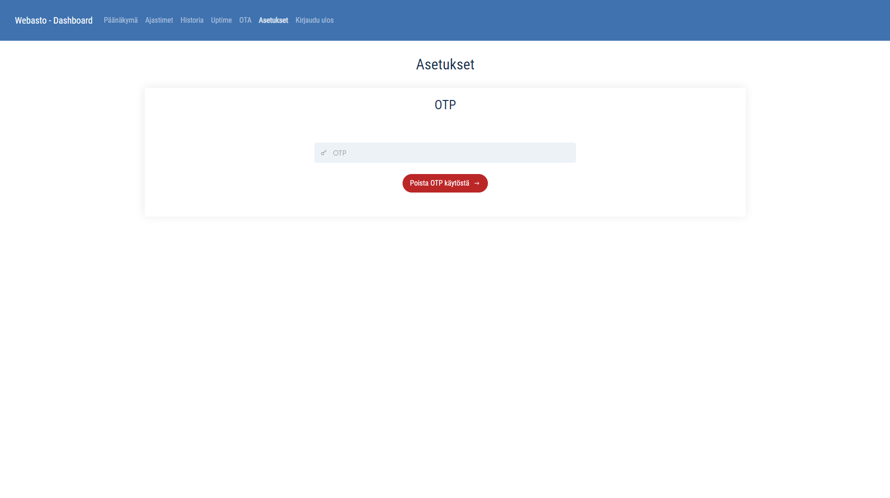

# Frontend for webasto project
Made with Vue.js 3 and [lightvue](https://lightvue.org) UI framework to **view** data from [webasto-backend](https://github.com/lassesuomela/webasto-backend) project.

# Demo available
[https://webasto.saunagaming.com](https://webasto.saunagaming.com)

Username: demo

Password: demo

---
Notes: 

* File upload disabled for now.
* Logout doesn't work properly. The JWT token still hangs around and API requests can still be made.
* The site is mostly in Finnish.

---

# Run down of the pages

### Home page:

Webasto status indicator and progress bar to see how long the webasto has been running and how long will it run. When was the data updated.

Temperature, humidity and signal strength are displayed.

Graph to plot temperature and humidity data from the past hour.

And another graph to plot the voltage data from the past hour.

---

### Timers page:

Table of the weekday timers if enabled the webasto would then turn on at specified time. 

---

### History page:

Table of the heating times that have been created.

---

### Action history page:

Table of the actions that have been made regarding that account that is logged in. I.e. successfull login, unsuccessfull login, API key authentication, file upload and so on.

---

### Uptime page:

Stacked bar graph to see the uptime of the webasto.

---

### OTA page:

Here user can upload .bin and .txt version file to the server and those would then be served in a Over The Air update.

---

### Settings page:

User can setup their authenticator app for One Time Password.

# How to run for development environment

`npm i` to install dependencies

`vue serve` to test it in development

The webpage should open in [http://localhost:8080](http://localhost:8080)

# How to run for production with backend in docker container

1. 
    Dockerfile has image building instructions. No need to change these.
    nginx.conf has Nginx configurations. Some of these you may need to change. E.g.

    - `ssl_certificate` path/to/cert;

    - `ssl_certificate_key` path/to/key;

    - `server_name` sub.domain.tld;

2.
    This frontend is supposed to be run with the [webasto-backend](https://github.com/lassesuomela/webasto-backend).

    In that repository there is a file `restart.sh`. It will build the docker images and start them. Inculding this one.

# Here are some images from the frontend

Login page

Home page

Home page lower half

Timers page

Logs page

Action history page

Uptime page

OTA update page

Settings for One Time Password First time setup

