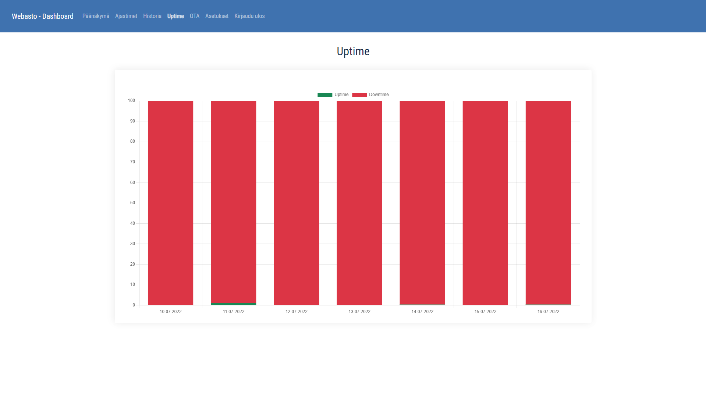

# Frontend for webasto project
Made with Vue.js 3 and [lightvue](https://lightvue.org) UI framework.

# How to run for development environment

`npm install` to install dependencies

`vue serve` to test it in development

The webpage should open in [http://localhost:3000](http://localhost:3000)

# How to run for production with backend in docker container

1. 
    Dockerfile has image building instructions. No need to change these.
    nginx.conf has Nginx configurations. Some of these you may need to change. E.g.

    - `ssl_certificate` path/to/cert;

    - `ssl_certificate_key` path/to/key;

    - `server_name` sub.domain.tld;

    - `./build.sh` to build docker image

2.
    This frontend is supposed to be run with the [webasto-backend](https://github.com/lassesuomela/webasto-backend).

    In that repository there is a file `restart.sh`. Follow the instructions on that repository to build docker image of the backend and run `./restart.sh` script.

# Here are some images from the frontend

Login page

Home page

Home page lower half

Timers page

Logs page

Action history page

Uptime page

OTA update page

Settings for One Time Password First time setup

